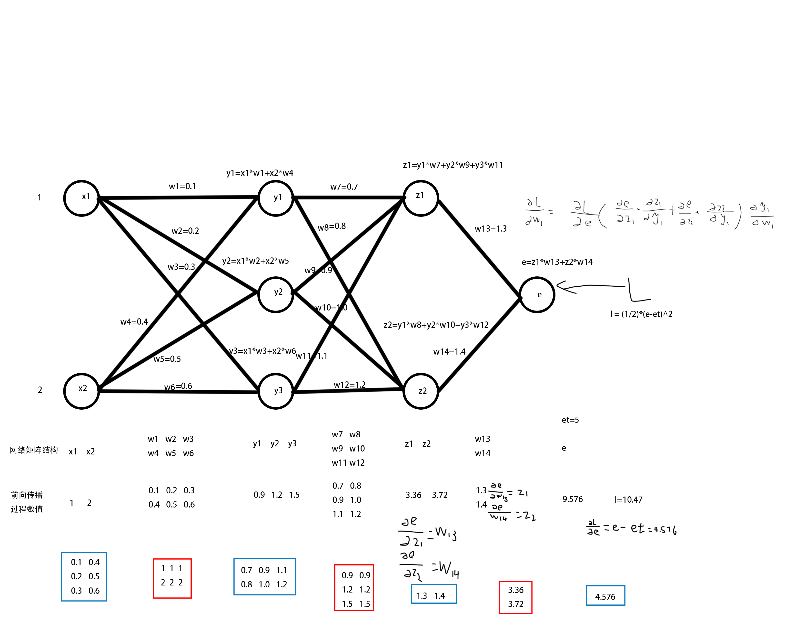

# neural-network-C

基于C语言的神经网络框架,目前包含全连接层。支持前向传播推理和反向传播训练。使用tensor实现各种功能，适合人工智能入门学习。

## 各文件的主要功能

tensor.c		:	tensor的各种基本运算，包括创建，删除tensor，矩阵乘法等。

net.c		 	:	神经网络的主体，包含网络的创建，添加层，前向，反向传播相关函数，优化器函数等。

compute.c	:	包含更加复杂的数学计算，包括损失函数，激活函数以及他们的导函数。

## 全连接层的数学推导



## 使用说明

1：创建一个网络 ：

```
	net_handle net = create_net();
```

2：给网络添加各种层（目前网络层次结构是一维的，通过双向链表实现）：

```
	add_fc_layer(net, 256, 128, relu);
	add_fc_layer(net, 128, 64, relu);
	add_fc_layer(net, 64, 10, none);
```

3：创建数据集和标签（相关功能正在开发中，目前只能通过二维数组添加）

```
	tensor_handle input = create_tensor_from_twodim_arr(16,16,nograd,num2);
	input = tensor_to_line(input);
	tensor_handle input1 = create_tensor_from_twodim_arr(16,16,nograd,num1);
	input1 = tensor_to_line(input1);
	
	tensor_handle input_t = create_tensor_from_twodim_arr(16,16,nograd,num2_t);
	input_t = tensor_to_line(input_t);
	tensor_handle input1_t = create_tensor_from_twodim_arr(16,16,nograd,num1_t);
	input1_t = tensor_to_line(input1_t);
	
	tensor_handle tureval = create_tensor_from_twodim_arr(1,10,nograd,et);
	tensor_handle tureval1 = create_tensor_from_twodim_arr(1,10,nograd,et1);
```

4：前向传播

```
	forward(net, input);
	float loss = compute_lose(net, MSE, tureval);//计算lose时需要指定损失函数
```

5：反向传播计算梯度

```
	backward(net, MSE_d, tureval);//反向传播时要使用lose函数对应的导函数
```

6：使用优化器更新参数

```
optimizer(net, 0.001f);
```

7：循环前向传播，反向传播，更新参数，直到lose值足够低

保存，加载网络的功能正在开发中，现在参数训练完成后无法保存，下次只能重新训练

目前该项目还处于未完成的状态，网络中仅添加了全连接层。卷积层和池化层正在开发中。

